# Toplogy Match Tokens

This document gives insights about Topology Match Tokens.

The detailed documentation about defining merge rules is availabe in IBM documentation https://www.ibm.com/docs/en/cloud-paks/cloud-pak-watson-aiops/3.4.2?topic=elements-configuring-rules

## 1. Create Match Token

1. Create match token with the below condition. 
- Tokens : `name`
- Resource Types         : `deployment`

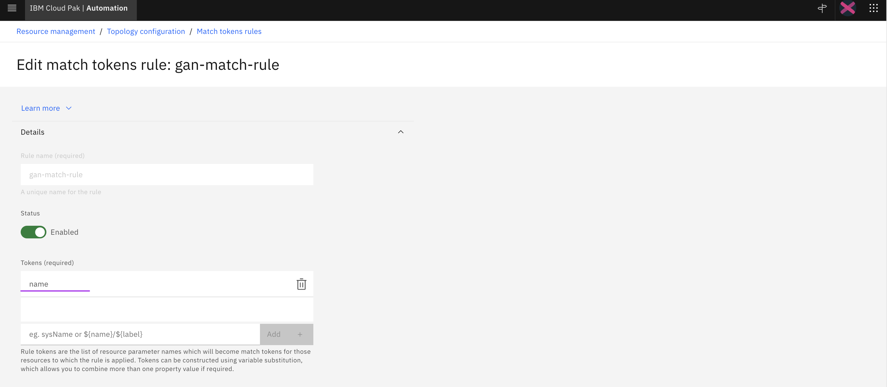
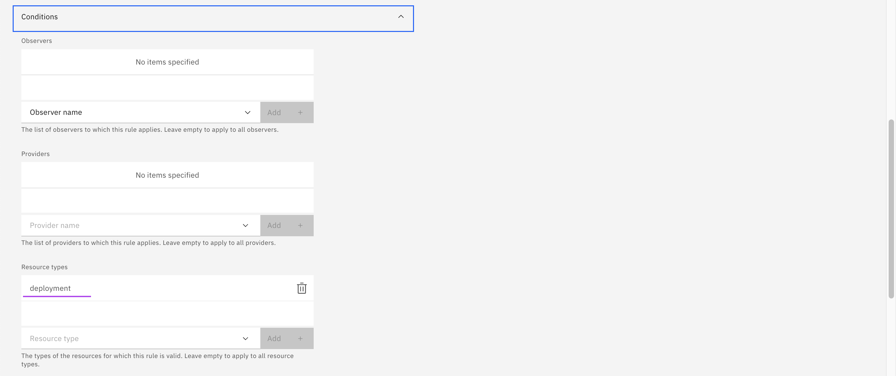
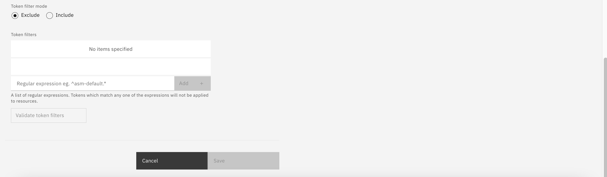

2. Merge Token Created
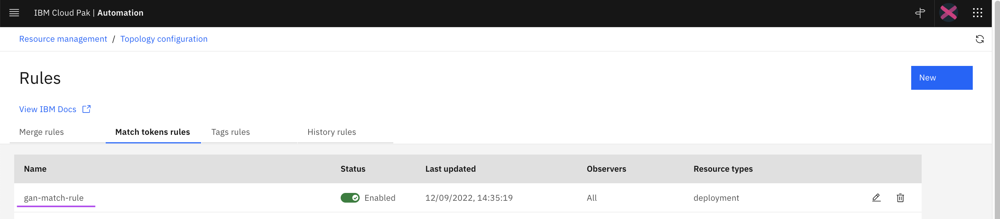

## 2. View Resource Details

The merge token is created. Let us review the Resource details with the merge token.

1. Right click on the `ilender-user` deployment resource and click on the `Resource details` menu.
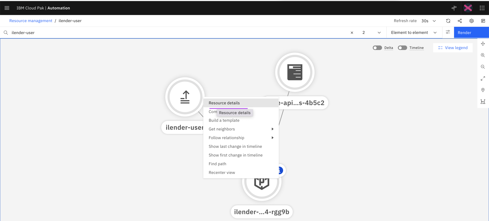

2. Here is the resource details of the `ilender-user` deployment. 

 You can see the properties like `_id`, `resourcetype` and etc.

Click on the `Show Json` option button.
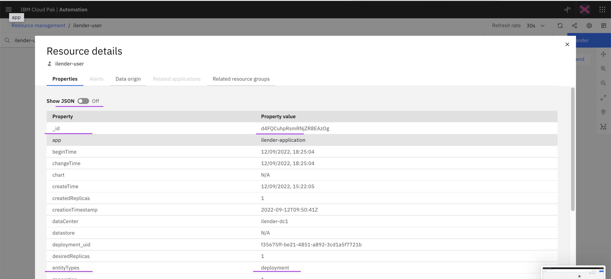

3. The json view of the `ilender-user` deployment resource properties is displayed. 

The json file is available [here](./files/resource-properties-in-json.json).

You can see the properties like `_id`, `resourcetype` and etc.

You can also note that the `matchTokens` property contains the values of 
 - unique id : `f35675ff-be21-4851-a892-3cd1a5f7721b`
 - deployment resource name : `ilender-user`

```
    "matchTokens": [
        "f35675ff-be21-4851-a892-3cd1a5f7721b",
        "ilender-user"
    ],
```

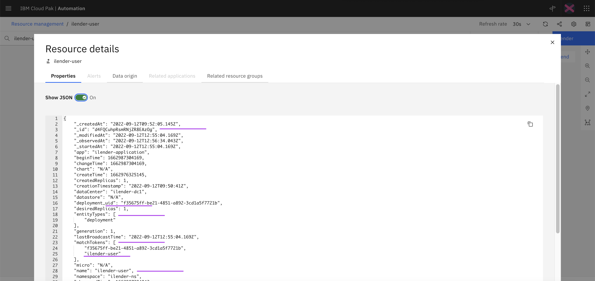


## 3. Pushing Events with Match Token

Lets push an event to kafka topic using match token and see in Alert Viewer. 

1. Create Kafka topic like this
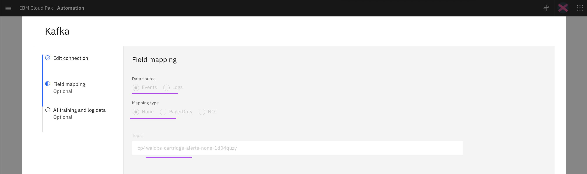

2. Create Event file like the below.  Sample file is available [here](./files/event-with-match-token.json)

The `ilender-user` value from this ` "application":"ilender-user" ` property would be taken and matched with fields `_id` and `matchTokens`.
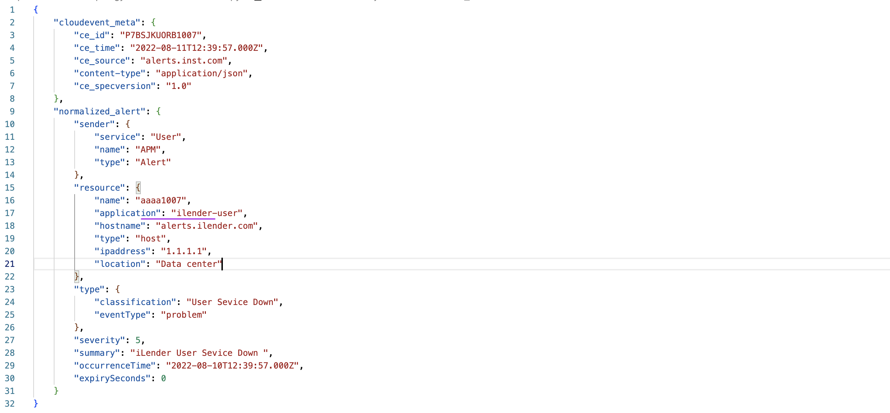

3. Push the events to kafka. 

Refer this article https://github.com/GandhiCloudLab/ibm-watson-aiops/tree/main/09-push-events-to-kafka-topic.

4. The pushed event is super embossed on the topology as an alert like the below.
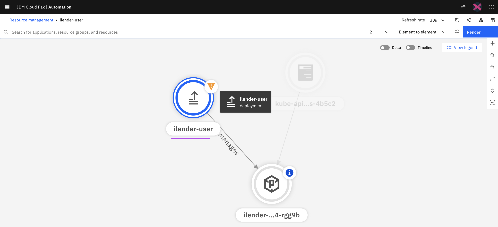

5. There is an alert created in the `Alert Viewer`.
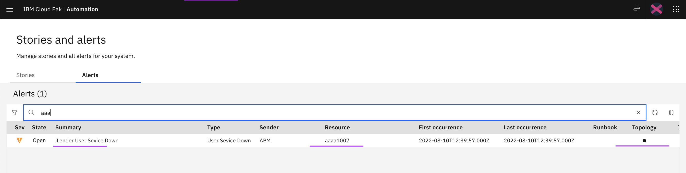


## 4. Pushing Events with _id

By default, `_id` field is used to map the event to topology resource. When the resources are recreated, then this `_id` would change, so event also to be modified. To overcome this probelm only the match token concept is available.

Lets see how `_id` field is used here.

1. Create Event file like the below. Sample file is available [here](./files/event-with-id.json)

The `f35675ff-be21-4851-a892-3cd1a5f7721b` value from this ` "application":"f35675ff-be21-4851-a892-3cd1a5f7721b" ` property would be taken and matched with field `_id` in the topology resources.

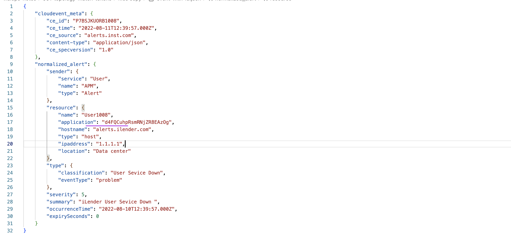

2. Push the events to kafka. 

3. There is an alert created in the `Alert Viewer`.
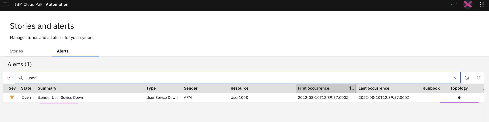

